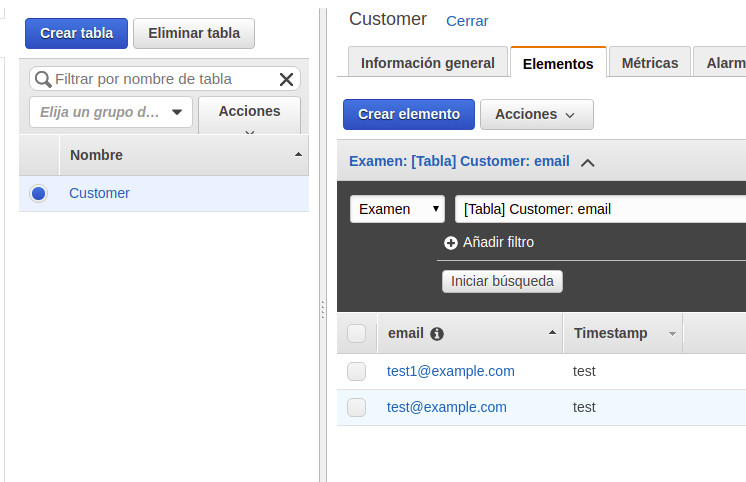
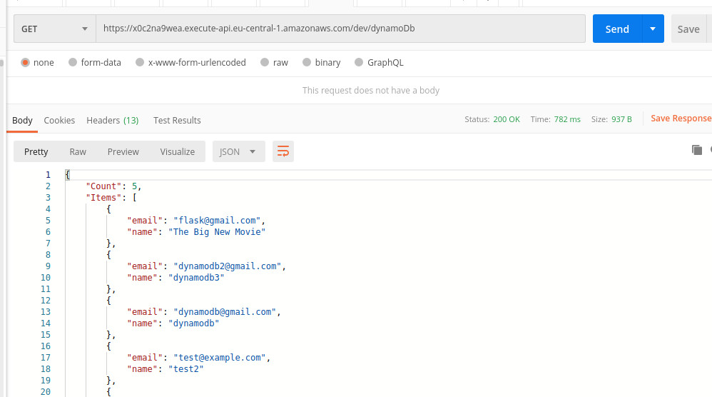
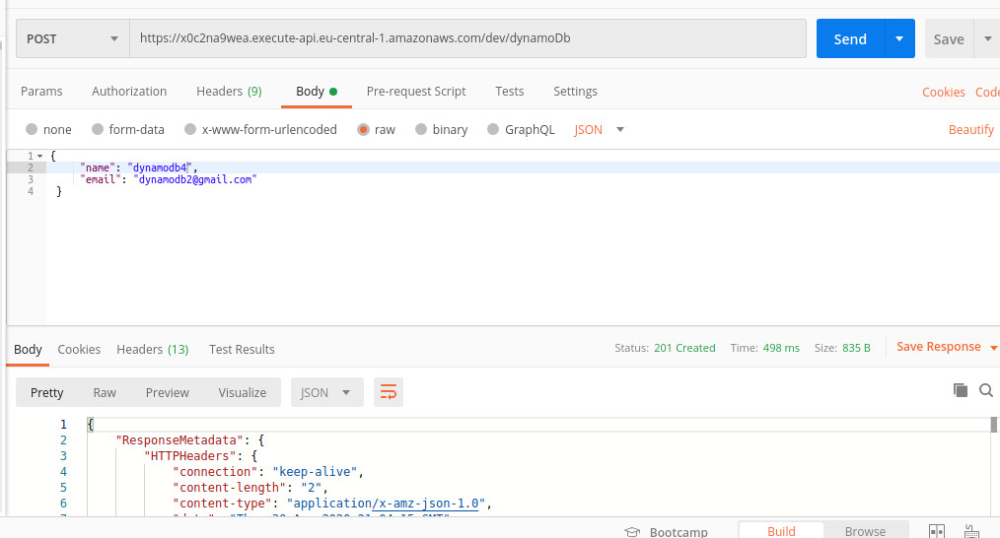
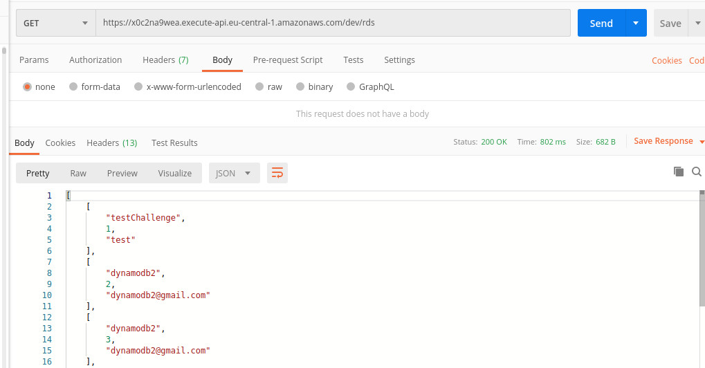
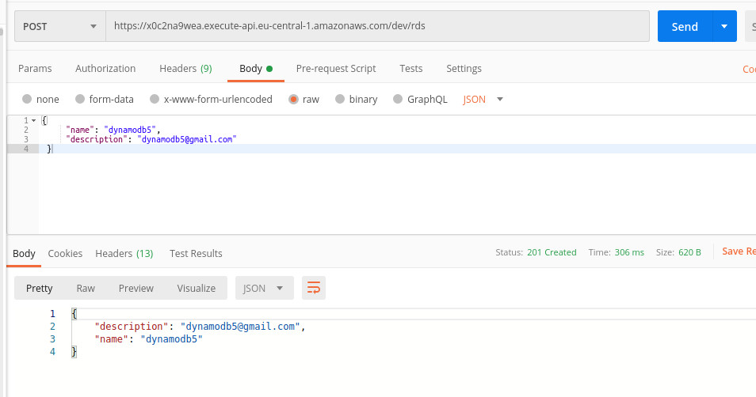

Python-Flask - AWS Lambda function to fetch data from a DynamoDB and a relational DB

Create and GetAll for DynamoDB and GET for RDS DB

Create table in DynamoDB and configure Key=TABLE_DYNAMO_DB in environment variables

URL: */dynamoDb

POST Body: 
{
     "name": "dynamodb3",
     "email": "dynamodb2@gmail.com"	
 }

RDS DB: 

URL: */rds

POST Body:
{
     "name": "dynamodb5",
     "description": "dynamodb5@gmail.com"	
 }

Test:

DynamoDB

 
 
GetALL
 

Post
  
  

RDS

GetALL
 

Post
  